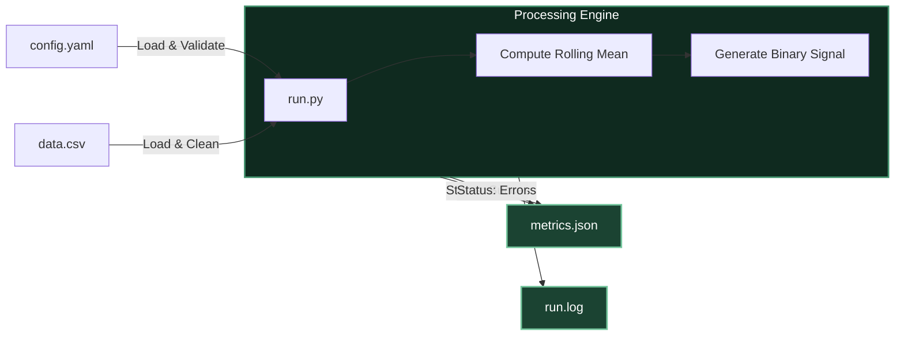

<div align="center">

<h1>⚡ PrimeTradeML</h1>
<p><b>Deterministic MLOps-Style Trading Signal Batch Job</b></p>
<p><i>A production-minded Python batch pipeline built for reproducible signal generation, robust error handling, and Docker-first execution readiness. Designed to mirror the rigor of MetaStackerBandit pipelines.</i></p>

<br />

[](https://python.org)
[](https://www.docker.com/)
[](https://yaml.org/)
[](https://pytest.org/)
[](./.github/workflows/validate.yml)

<br />

**Task Focus:** Reproducibility, observability, deployment readiness  
**Domain Fit:** Trading-signal style batch processing  
**Primary Output:** `metrics.json` and `run.log`

</div>

---

## 📑 Table of Contents
- [Objective](#-objective)
- [Why This Submission Stands Out](#-why-this-submission-stands-out)
- [System Architecture](#-system-architecture)
- [Project Snapshot](#-project-snapshot)
- [Processing Logic](#-processing-logic)
- [Validation and Error Handling](#-validation-and-error-handling)
- [Usage: Local & Docker](#-usage-local--docker)
- [Example Output](#-example-output)

---

## 🎯 Objective

Build a minimal but professional MLOps-style batch job in Python that demonstrates:
- **Deterministic Execution** through configuration-driven runs (fixed seeds and window sizes).
- **Operational Visibility** through structured logs and machine-readable metrics (`metrics.json`).
- **Deployment Readiness** through a Dockerized, one-command runtime environment.

---

## 🧠 What Exactly Does This Code Do?

At its core, this project is an automated **Data Engineering & Trading Pipeline**. 

Here is a plain-English breakdown of how it works:
1. **The Data:** It ingests `data.csv`, which contains 10,000 rows of historical Bitcoin price data.
2. **The Math:** It calculates a **Rolling Mean** (a moving average) of the closing price over a specific time window. In `config.yaml`, this is set to `5`.
3. **The Signal:** It compares the current Close price to this Rolling Mean:
   - If `Close > Rolling Mean`, it generates a **1 (Bullish Signal)**.
   - Otherwise, it generates a **0 (Bearish Signal)**.
4. **The Output:** It calculates the **Signal Rate** (the percentage of the time the signal was `1`, which is `0.4991` or 49.91%). It then outputs this metric into a clean, machine-readable `metrics.json` file for downstream systems to consume.

This project proves how to take a simple mathematical idea and write it so securely that it can run unattended on a server without breaking.

---

## ⭐ Why This Submission Stands Out

- **Zero Hard-coded Paths:** Adheres strictly to the required CLI contract using relative paths.
- **Resilient Metrics Emission:** Guarantees `metrics.json` is written in **both** success and failure scenarios (graceful degradation).
- **Robust Data Parsing:** Safely processes the unique dataset format, elegantly handling its quoted-row CSV formatting quirk without pandas warnings.
- **Explicit Warm-up Logic:** The first `window - 1` rows are cleanly excluded from signal-rate averaging, avoiding mathematical bias.
- **Comprehensive Test Suite:** Evaluator-facing CLI tests and unit tests ensuring structural and logical determinism (`pytest`).
- **Docker-First Architecture:** Leverages a multi-stage-friendly `python:3.9-slim` image, verified with the exact evaluator run commands.
- **CI/CD Automation Built-in:** Includes a GitHub Actions workflow to run the test suite and build the Docker image on every push.

---

## 📐 System Architecture

### High-Level Execution Flow



### Processing Philosophy
- **Configuration is King:** The YAML configuration is the single source of truth for `seed`, `window`, and `version`.
- **Validate Before Computing:** Strict schema validation occurs before a single dataframe operation begins.
- **Clean Stdout:** Standard output is reserved *exclusively* for the final machine-readable metrics JSON, making it perfect for pipeline integration.

---

## 📊 Project Snapshot

| Category | Details |
|:---|:---|
| **Task** | Minimal MLOps-style batch job for trading-signal computation |
| **Language** | Python 3.9+ |
| **Config Source** | `config.yaml` |
| **Input Dataset** | `data.csv` (10,000 OHLCV rows) |
| **Signal Rule** | `signal = 1 if close > rolling_mean else 0` |
| **Rolling Window** | `5` (configurable) |
| **Sample Signal Rate** | `0.4991` |
| **Rows Processed** | `10000` |
| **Success Artifacts** | `metrics.json`, `run.log` |
| **Container Base** | `python:3.9-slim` |

---

## ⚙️ Processing Logic

### 1. Config Loading
Reads `config.yaml` and enforces strict validation:
- `seed` exists and is an integer.
- `window` exists and is a positive integer.
- `version` exists and is a non-empty string.
- Pipeline seed is set immediately for determinism.

### 2. Dataset Validation
Safely loads the dataset with robust error handling for:
- Missing or completely empty input files.
- Malformed CSV rows (handles the entire-row-quoted anomaly securely).
- Missing required `close` column.
- Non-numeric anomalies inside the `close` column.

### 3. Rolling Mean & Warm-Up Handling
The rolling mean is computed on `close` using the configured window.
- **Warm-up logic:** The first `window - 1` rows do not have a complete rolling window.
- These rows are treated as undefined (`NaN`) for rolling-mean evaluation and are safely **excluded** from the signal-rate denominator.

### 4. Signal Logic
For every valid row where the rolling mean is defined:
```python
signal = 1 if close > rolling_mean else 0
```

---

## 🛡️ Validation and Error Handling

| Scenario | System Behavior |
|:---|:---|
| **Missing input file** | Fails cleanly, writes error state to `metrics.json`, logs the exception |
| **Invalid CSV format** | Detects malformed row structure and gracefully exits non-zero |
| **Empty file** | Fails with an explicit validation error message |
| **Missing `close` column** | Fails with a clear schema validation message |
| **Invalid config structure**| Rejects missing or malformed config keys before processing |
| **Success path** | Writes metrics, logs trace, prints final JSON to stdout, exits `0` |

---

## 💻 Usage: Local & Docker

### Local Environment
Requires Python 3.9+ and `pip`.

```bash
# 1. Create and activate a virtual environment
python3 -m venv .venv
source .venv/bin/activate

# 2. Install required dependencies
pip install -r requirements.txt pytest

# 3. Run the complete test suite
pytest tests/ -v

# 4. Execute the batch pipeline
python run.py --input data.csv --config config.yaml --output metrics.json --log-file run.log
```
*Alternatively, use the provided `Makefile`: `make install`, `make test`, `make run`.*

### Docker Deployment
The project is container-ready. 

```bash
# Build the Docker image
docker build -t mlops-task .

# Run the container (executes default pipeline)
docker run --rm mlops-task
```
**Docker Runtime Guarantees:**
- `data.csv` and `config.yaml` are baked into the image.
- Final metrics JSON is printed securely to stdout.
- Success exits with code `0`; failures gracefully exit with a non-zero code.

---

## 📜 Example Output

### `metrics.json`
```json
{
  "version": "v1",
  "rows_processed": 10000,
  "metric": "signal_rate",
  "value": 0.4991,
  "latency_ms": 11,
  "seed": 42,
  "status": "success"
}
```

### `run.log` (Snippet)
```text
2026-04-23 00:51:10 | INFO     | JOB START  |  2026-04-22 19:21:10 UTC
2026-04-23 00:51:10 | INFO     | Config loaded and validated  |  seed=42  window=5  version=v1
2026-04-23 00:51:10 | INFO     | Dataset loaded  |  rows=10000  columns=7  close_range=[41939.28, 50949.16]
2026-04-23 00:51:10 | INFO     | Rolling mean computed  |  window=5  valid_rows=9996  nan_rows=4
2026-04-23 00:51:10 | INFO     | Signals generated  |  bullish=4989  bearish=5007  excluded(NaN)=4
2026-04-23 00:51:10 | INFO     | Metrics computed  |  rows_processed=10000  valid_signal_rows=9996  signal_rate=0.4991  latency_ms=11
2026-04-23 00:51:10 | INFO     | JOB END  |  status=SUCCESS  |  duration=11ms
```

---
<div align="center">
  <p><i>Submission prepared with a focus on enterprise reliability and exact task adherence.</i></p>
</div>
