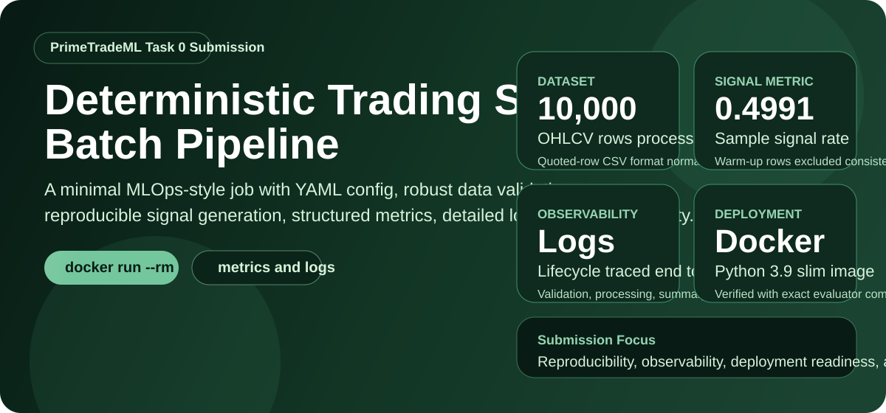
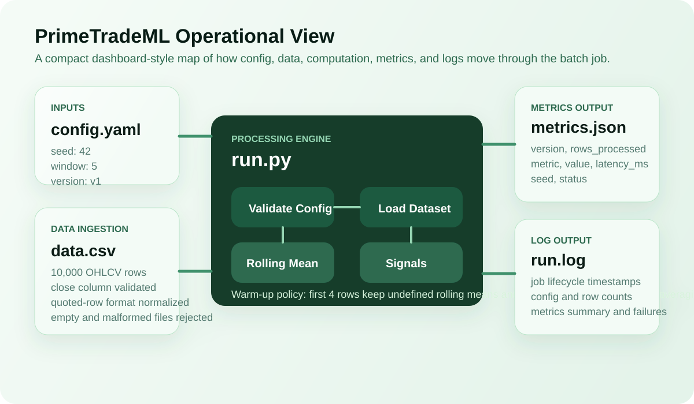
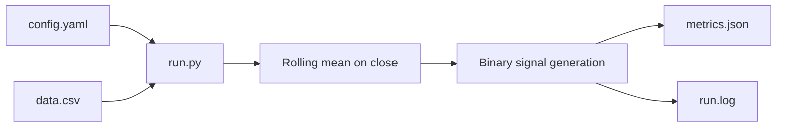

<div align="center">

# PrimeTradeML

### Deterministic MLOps-Style Trading Signal Batch Job

*A production-minded Python batch pipeline for reproducible signal generation, machine-readable observability, and Docker-first execution readiness.*

[](https://python.org)
[](https://www.docker.com/)
[](https://yaml.org/)
[](#validation-and-error-handling)
[](#verification-checklist)
[](./.github/workflows/validate.yml)

<br/>



<br/>

**Task Focus:** Reproducibility, observability, deployment readiness  
**Domain Fit:** Trading-signal style batch processing for MetaStackerBandit-like pipelines  
**Primary Output:** `metrics.json` and `run.log`

</div>

---

## Table of Contents

- [Objective](#objective)
- [Why This Submission Stands Out](#why-this-submission-stands-out)
- [Project Snapshot](#project-snapshot)
- [System View](#system-view)
- [Repository Structure](#repository-structure)
- [Processing Logic](#processing-logic)
- [Validation and Error Handling](#validation-and-error-handling)
- [Local Run](#local-run)
- [Docker Run](#docker-run)
- [Example Output](#example-output)
- [Verification Checklist](#verification-checklist)
- [Evaluation Rubric Alignment](#evaluation-rubric-alignment)
- [CI Automation](#ci-automation)

---

## Objective

Build a minimal but professional MLOps-style batch job in Python that demonstrates:

- deterministic execution through configuration-driven runs
- operational visibility through structured logs and machine-readable metrics
- deployment readiness through a Dockerized, one-command runtime

This repository is intentionally shaped like a small trading-signal production component. It ingests market-style OHLCV data, computes a rolling mean on `close`, generates a binary signal, emits metrics, and handles failures cleanly enough to be monitored in an automated pipeline.

---

## Why This Submission Stands Out

- It follows the exact required CLI contract with no hard-coded paths.
- It writes `metrics.json` in both success and failure scenarios.
- It handles the provided dataset robustly, including its quoted-row CSV formatting quirk.
- It documents the warm-up behavior explicitly: the first `window - 1` rows are excluded from signal-rate averaging because the rolling mean is not yet defined.
- It includes evaluator-facing CLI tests, not just helper-function tests.
- It includes a Docker image verified with the exact evaluator commands.
- It includes a GitHub Actions workflow so the same checks can run automatically on every push.

---

## Project Snapshot

| Category | Details |
|:--|:--|
| **Task** | Minimal MLOps-style batch job for trading-signal computation |
| **Language** | Python |
| **Config Source** | `config.yaml` |
| **Input Dataset** | `data.csv` with 10,000 OHLCV rows |
| **Signal Rule** | `signal = 1 if close > rolling_mean else 0` |
| **Rolling Window** | `5` from config |
| **Sample Signal Rate** | `0.4991` |
| **Rows Processed** | `10000` |
| **Success Artifacts** | `metrics.json`, `run.log` |
| **Container Base** | `python:3.9-slim` |
| **Verification** | Local CLI run, test suite, Docker build, Docker run |

---

## System View



### High-Level Architecture



### Processing Philosophy

- Configuration is the single source of truth for `seed`, `window`, and `version`.
- The pipeline validates before it computes.
- Observability is treated as a first-class output, not an afterthought.
- Stdout is kept clean so the final metrics JSON is easy to consume in local and container runs.

---

## Repository Structure

```text
PrimeTradeML/
├── .github/
│   └── workflows/
│       └── validate.yml
├── docs/
│   └── assets/
│       ├── hero.svg
│       └── pipeline-board.svg
├── tests/
│   └── test_pipeline.py
├── .dockerignore
├── .gitignore
├── config.yaml
├── data.csv
├── Dockerfile
├── Makefile
├── metrics.json
├── README.md
├── requirements.txt
├── run.log
└── run.py
```

---

## Processing Logic

### 1. Config Loading

The pipeline reads `config.yaml` and validates:

- `seed` exists and is an integer
- `window` exists and is a positive integer
- `version` exists and is a non-empty string

The run is then seeded deterministically from config so that execution is reproducible.

### 2. Dataset Validation

The loader checks:

- missing input file
- unreadable or empty input
- malformed CSV rows
- missing required `close` column
- non-numeric values inside the `close` column

### 3. Rolling Mean Logic

The rolling mean is computed on `close` using the configured window.

Warm-up handling:

- The first `window - 1` rows do not have a complete rolling window.
- Those rows are treated as undefined for rolling-mean evaluation.
- They are excluded from the signal-rate denominator.

For this task with `window: 5`, that means the first `4` rows are excluded from signal-rate averaging.

### 4. Signal Logic

For every row where the rolling mean is defined:

```text
signal = 1 if close > rolling_mean
signal = 0 otherwise
```

### 5. Metrics Emission

On success, the job writes:

```json
{
  "version": "v1",
  "rows_processed": 10000,
  "metric": "signal_rate",
  "value": 0.4991,
  "latency_ms": 14,
  "seed": 42,
  "status": "success"
}
```

On failure, the job still writes a metrics file:

```json
{
  "version": "v1",
  "status": "error",
  "error_message": "Description of what went wrong"
}
```

---

## Validation and Error Handling

| Scenario | Behavior |
|:--|:--|
| **Missing input file** | Fails cleanly, writes error `metrics.json`, logs the validation exception |
| **Invalid CSV format** | Detects malformed row structure and exits non-zero |
| **Empty file** | Fails with an explicit error message |
| **Missing `close` column** | Fails with a clear schema validation message |
| **Invalid config structure** | Rejects missing or malformed config keys before processing |
| **Success path** | Writes metrics, writes logs, prints final JSON to stdout, exits `0` |

### Observability Signals Included in `run.log`

- job start timestamp
- config load and validation
- row count loaded
- rolling mean step start
- signal generation step start
- metrics summary
- job end status
- validation and unexpected exception details

---

## Local Run

### Prerequisites

- Python 3.9 or newer
- `pip`

### Install Dependencies

```bash
python3 -m venv .venv
. .venv/bin/activate
python -m pip install -r requirements.txt pytest
```

### Run the Batch Job

```bash
python run.py --input data.csv --config config.yaml --output metrics.json --log-file run.log
```

### Optional Makefile Shortcuts

```bash
make install
make run
make test
```

---

## Docker Run

### Build the Image

```bash
docker build -t mlops-task .
```

### Run the Container

```bash
docker run --rm mlops-task
```

### Docker Runtime Guarantees

- `data.csv` and `config.yaml` are baked into the image
- the container writes `metrics.json` and `run.log`
- final metrics JSON is printed to stdout
- success exits with code `0`
- failures exit with a non-zero code

---

## Example Output

### `metrics.json`

```json
{
  "version": "v1",
  "rows_processed": 10000,
  "metric": "signal_rate",
  "value": 0.4991,
  "latency_ms": 14,
  "seed": 42,
  "status": "success"
}
```

### `run.log`

```text
2026-04-23 00:44:04 | INFO     | JOB START  |  2026-04-22 19:14:04 UTC
2026-04-23 00:44:04 | INFO     | Config loaded and validated  |  seed=42  window=5  version=v1
2026-04-23 00:44:04 | INFO     | Dataset loaded  |  rows=10000  columns=7  close_range=[41939.28, 50949.16]
2026-04-23 00:44:04 | INFO     | Rolling mean computed  |  window=5  valid_rows=9996  nan_rows=4
2026-04-23 00:44:04 | INFO     | Signals generated  |  bullish=4989  bearish=5007  excluded(NaN)=4
2026-04-23 00:44:04 | INFO     | Metrics computed  |  rows_processed=10000  valid_signal_rows=9996  signal_rate=0.4991  latency_ms=14
2026-04-23 00:44:04 | INFO     | JOB END  |  status=SUCCESS  |  duration=14ms
```

### Determinism Note

- `rows_processed`, `metric`, `value`, `seed`, and `status` remain stable for the same input and config.
- `latency_ms` is environment-dependent by design and will vary across machines and container runs.

---

## Verification Checklist

The following checks were executed against this repository:

| Check | Command | Result |
|:--|:--|:--|
| **Local CLI run** | `python run.py --input data.csv --config config.yaml --output metrics.json --log-file run.log` | Passed |
| **Test suite** | `pytest tests/test_pipeline.py -q` | Passed |
| **Docker build** | `docker build -t mlops-task .` | Passed |
| **Docker run** | `docker run --rm mlops-task` | Passed |
| **In-container artifact check** | verified `metrics.json` and `run.log` exist during container execution | Passed |

---

## Evaluation Rubric Alignment

| Rubric Area | How This Repo Addresses It |
|:--|:--|
| **Correctness and determinism (40%)** | Config-driven execution, stable signal logic, explicit warm-up policy, consistent output schema |
| **Dockerization (25%)** | Uses `python:3.9-slim`, copies required inputs, supports exact evaluator build and run commands |
| **Code quality (20%)** | Clean single-entry CLI, validation helpers, defensive error handling, readable structure |
| **Observability (15%)** | Logs all major lifecycle events, always emits machine-readable metrics, keeps stdout machine-friendly |

---

## CI Automation

This repository includes `.github/workflows/validate.yml`, which automates:

- dependency installation
- test execution
- local batch-job execution
- Docker image build
- Docker container run

That means the same checks used during local development can also be replayed automatically in GitHub Actions.

---

## Closing Note

This submission is designed to do more than satisfy the minimum task checklist. It is organized like a small but real production component: validated inputs, deterministic behavior, operational traceability, Docker execution, sample artifacts, automated verification, and reviewer-friendly documentation that explains both what the code does and why it was implemented this way.
